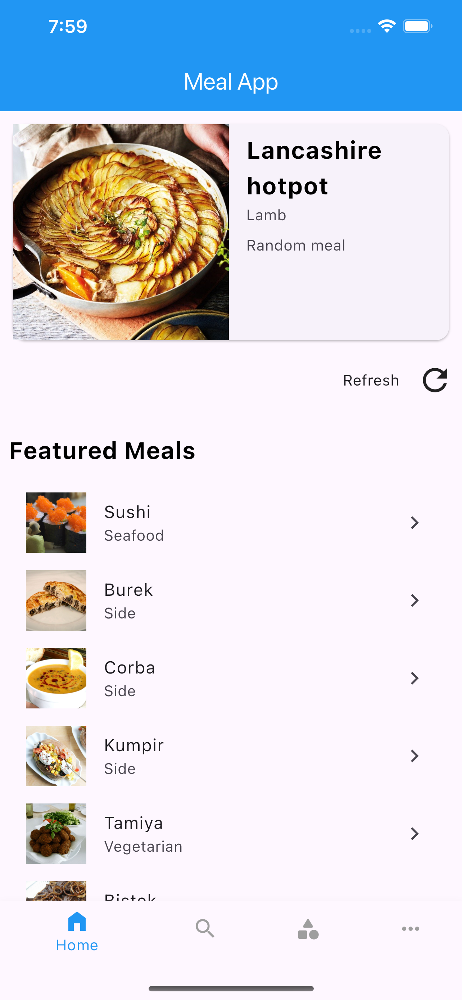
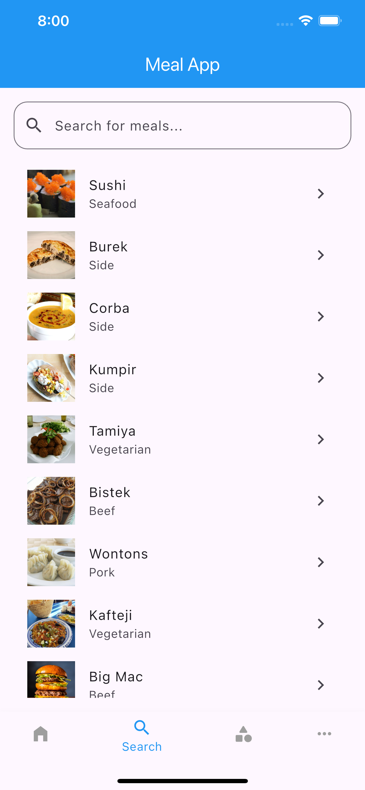
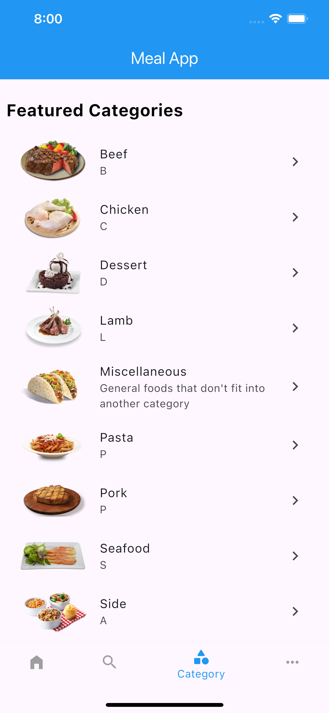
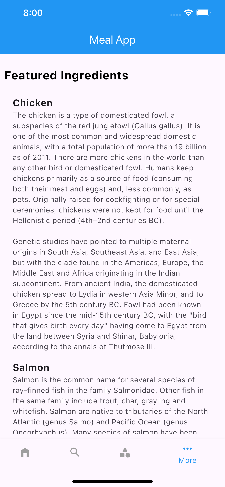
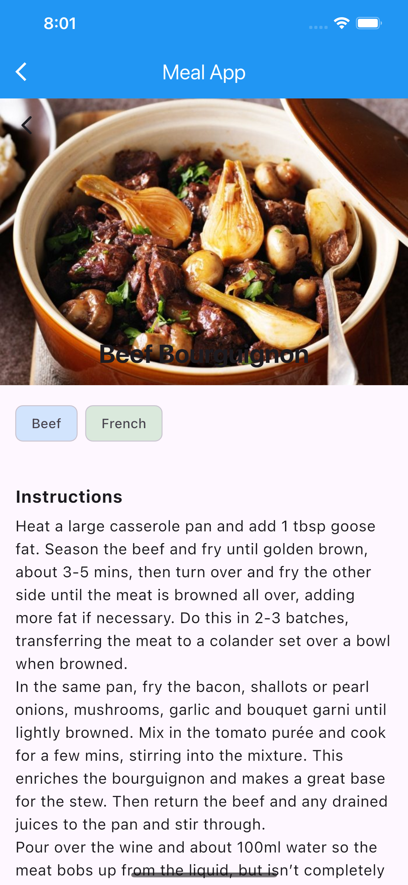

## Recipe Finder App (Flutter + MVVM + GetX)

A **modern Recipe Finder app** built with **Flutter** using **GetX** for state management. This app fetches delicious recipes from **TheMealDB API** and provides an interactive and smooth user experience.

---

### Features

- **Browse Recipes** – View a variety of meals with images and descriptions.  

- **Search Recipes** – Find meals by name or ingredients.  

- **Filter by Category** – Explore meals based on different categories (e.g., Vegetarian, Seafood). 

- **View Recipe Details** – See ingredients, instructions, and preparation steps.  

---

## 🛠️ Tech Stack
- **Flutter** – UI Framework  
- **Dart** – Programming Language  
- **GetX** – State Management  
- **Dio** – API Client  
- **TheMealDB API** – Recipe Data Source  

---

### Why Use GetX?
We are using GetX for:

- **State Management** → Easily update UI when data changes

- **Dependency Injection** → Manage controllers efficiently

- **Navigation** → Navigate between screens without BuildContext

---

## Why MVVM Architecture?
- Model (M): Represents the data (API response models)

- View (V): UI screens (Home Screen, Meal Detail Screen)

- ViewModel (VM): Business logic (Fetching data, handling user actions)

---

### Dependencies used in this project
##### dependencies
- **get** → Manage state & navigation

- **dio** → Handle API requests

- **cached_network_image** → Cache images for better performance

###### Terminal code to add required dependencies
    flutter pub add get dio cached_network_image json_annotation

##### dev dependencies

-**flutter_lints** → Enforce best coding practices

- **build_runner** & json_serializable → Help with data modeling

###### Terminal code to add required dependencies
    flutter pub add flutter_lints build_runner json_serializable --dev

---

## 🏗️ Project Structure

Now that we have set up the **dependencies**, let’s organize our project into a **structured MVVM pattern**. This ensures **scalability**, **maintainability**, and **clean code**.

#### folder structure
    /lib
    ├── models/             # Data models for API response
    │   ├── meal.dart
    │
    ├── controllers/        # Business logic (ViewModel in MVVM)
    │   ├── meal_controller.dart
    │
    ├── views/              # UI components (Screens)
    │   ├── home_view.dart
    │   ├── meal_detail_view.dart
    │
    ├── services/           # API handling (Networking)
    │   ├── api_service.dart
    │
    ├── main.dart           # App entry point

**1 - models**/ → **Data Models**

- This folder contains Dart classes that represent data structures (e.g., a Meal model for API responses).

- It helps in parsing JSON data and keeping the code clean.

**2 - controllers**/ → **ViewModels (Business Logic)**

- This folder contains **GetX controllers** that manage business logic.

- It interacts with **services**/ (API calls) and notifies the UI when data updates.

**3 - views**/ → **UI Screens**

- This folder contains all **UI components** (**screens** & **widgets**).

- It listens to the **controllers**/ for updates and displays data.

**4 - services**/ → **API Services**

- This folder contains **networking logic** (fetching data from APIs)

- It uses **Dio** to make **HTTP requests** and return the data.

**4 - main.dart**/ → **Entry Point**

- The starting point of the app where everything is initialized.

- It sets up GetX for navigation and state management

---

## 📡 API Usage
This app fetches meal data from **[TheMealDB API](https://www.themealdb.com/api.php)**.  

### 📌 **How to Get API Data?**
1. Go to **[TheMealDB API](https://www.themealdb.com/api.php)**.  

2. Use the **free API** (No key required). Example API URL:  https://www.themealdb.com/api/json/v1/1/search.php?s=chicken

---

## Understanding JSON Serialization in Flutter
When working with **APIs**, data is typically received in **JSON format**. In **Flutter**, we **convert JSON** to **Dart objects** (**models**) and **Dart objects** back to **JSON** for easy manipulation.

### We used dependency for json conversion

##### Why JSON Serialization?

> JSON serialization is required to:
>> Convert **JSON** data (from an API) into **Dart objects**.
>> Convert **Dart objects** back into **JSON** (for sending data).
>> **Improve performance** by handling large amounts of data efficiently.

##### How Does json_annotation Work?
> **json_annotation** provides annotations (like  @JsonSerializable() )
>> Which classes should be **serialized**/**deserialized**
>> How to map **JSON keys** to class properties.
>> The **@JsonSerializable()** annotation enables automatic serialization.

 ##### How Does build_runner Work?
> build_runner is a tool that generates boilerplate code automatically.
>> It scans all classes marked with @JsonSerializable().
>> It creates a separate file (your_model.g.dart) with the necessary serialization logic.

##### Run This Command to Generate Code:
    flutter pub run build_runner build

##### Auto Generated file mostly have two method 
##### 1 YourModelFromJson
    _$YourModelFromJson(Map<String, dynamic> json) → YourModel
This function converts JSON data into a Dart object (Meal).
##### 2 YourModelToJson
    _$YourModelToJson(Meal instance) → Map<String, dynamic>
This function converts a Dart object (Meal) back into JSON.

---

##### Why Do We Need an API Service?
- API calls should be separate from UI logic for clean architecture.

- This makes our code modular, reusable, and testable.

- We centralize API handling in one place (api_service.dart).

##### Why Do We Need an API Service?
- Make HTTP requests to get meal data

- Parse the JSON response into a Meal object

- Use dio for efficient API handling

##### Why use dio for API calls?
- It is faster and more efficient than http.

- It supports interceptors, error handling, and logging.

---
## 🎨 Screenshots

---
feel free to use and modify it.

## Contributing
Pull requests are welcome! Please fork the repository and submit a PR if you'd like to contribute.

### Author
##### Md Zahidul Islam Shohan

**mdzahidulislamshohan@gmail.com**

**[LinkedIn](https://www.linkedin.com/in/md-zahidul-islam-shohan/)**

**[Portfolio](https://zis-softworks.vercel.app/)**

---

### **How to Use This `README.md` in Your GitHub Repo?**
1. **Replace `"yourusername"`** with your **GitHub username** in the clone URL.  

2. **Add screenshots** once your app UI is ready.  

3. **Update the Author section** with your actual **email, LinkedIn, and portfolio links**.

4. **Customize as needed** (e.g., add features or changes).  

This `README.md` will make your **GitHub repo look professional** and **impressive to recruiters**! 🚀🔥  
